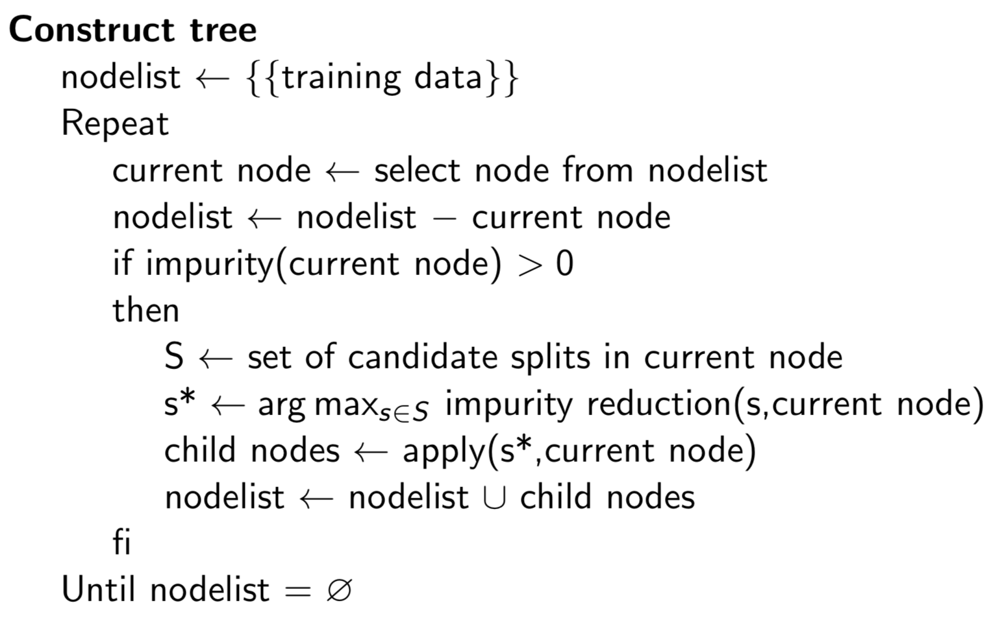
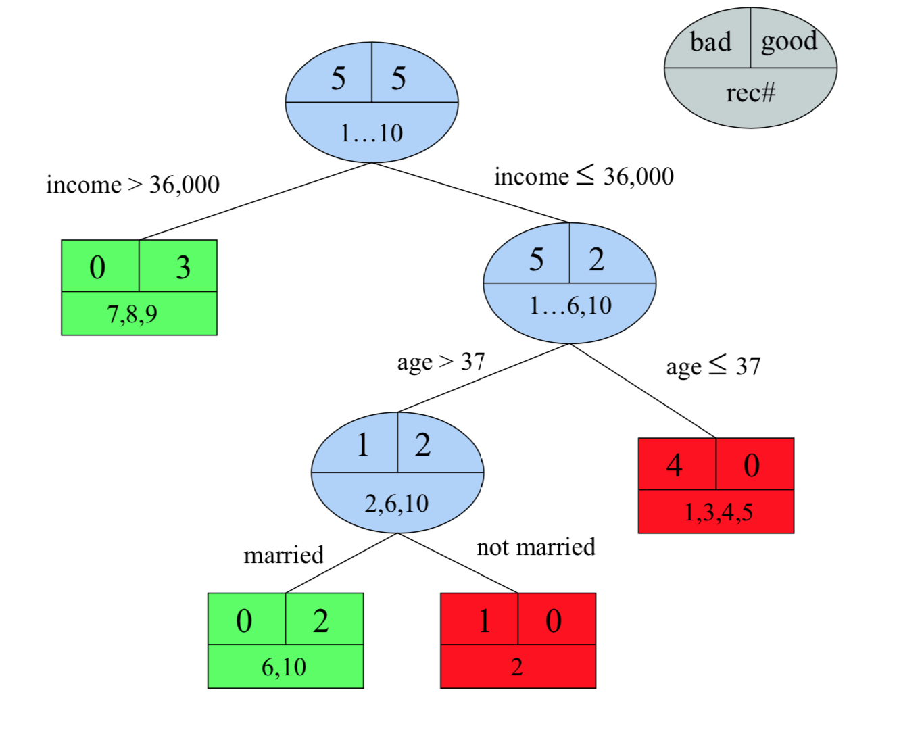
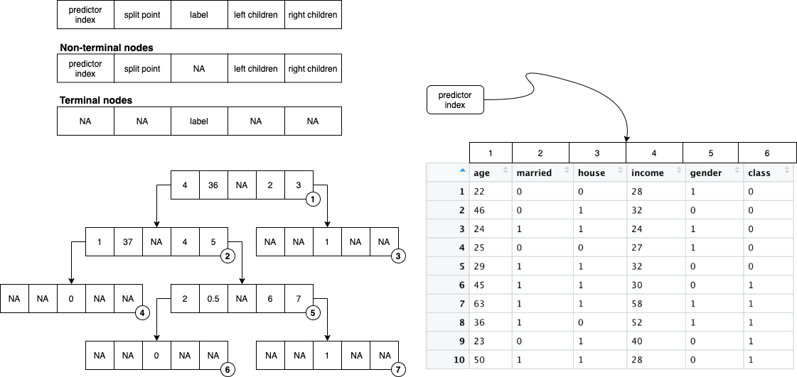
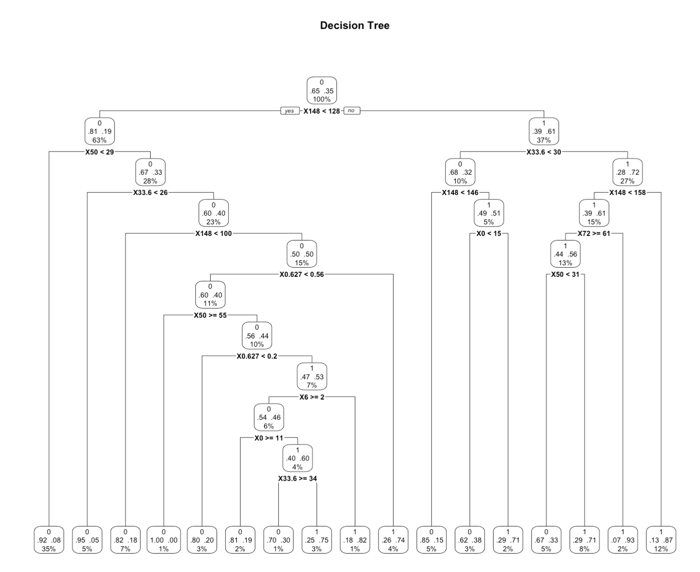

# Code

## Algorithm

<p float="left">
  
</p>

**tree_grow()** function is written accordingly with the code structure as below:
```
tree_grow <- function(table, nmin, minleaf, nfeat) {
  
  # nodelist <- {{training data}}
  nodelist <- list(table)
  
  repeat{
    
    # current_node <- select node from nodelist
    current_node <- nodelist[[1]]
    # nodelist <- nodelist - current node
    nodelist[[1]] <- NULL
    
    # if impurity(current node) > 0 AND observations(current node) >= nmin, the current node is allowed to be split.
    if(impurity_by_gini_index(current_node[,nfeat+1]) > 0 && length(current_node[,1]) >= nmin) {
      
      # S <- set of candidate splits in current node
      # s* <- argmax {impurity reduction(s, current node)}, where s is in S
      for(feat in 1:nfeat) {
        result <- bestsplit(current_node[,feat], current_node[,nfeat+1])
      }
      
      # child nodes <- apply(s*, current node)
      left_children <- current_node[current_node[,feat.best] <= feat.splitpoints.best,]
      right_children <- current_node[current_node[,feat.best] > feat.splitpoints.best,]
      
      # check minleaf constraint
      if(length(left_children[,1]) < minleaf || length(right_children[,1]) < minleaf) {
      	# if observations(child nodes) < minleaf, stop splitting
        next
      } else {
        # if observations(child nodes) >= minleaf, nodelist <- nodelist + child nodes
        nodelist[[length(nodelist) + 1]] <- left_children
        nodelist[[length(nodelist) + 1]] <- right_children
      }
    }

    # until nodelist = ∅
    if(length(nodelist) == 0)
      break
  }
}
```

## Tree model

<p float="left">
  
</p>

**tree_pred()** function uses the tree model to predict the label, and its data structure is a list of vectors as illustrated below:
* list <- [c(4, 36, NA, 2, 3), c(1, 37, NA, 4, 5), c(NA, NA, 1, NA, NA), c(NA, NA, 0, NA, NA), c(2, 0.5, NA, 6, 7), c(NA, NA, 0, NA, NA), c(NA, NA, 1, NA, NA)]

<p float="left">
  
</p>

## Test

**rpart()** generates below decision tree based on the dataset "pima.txt":

<p float="left">
  
</p>
