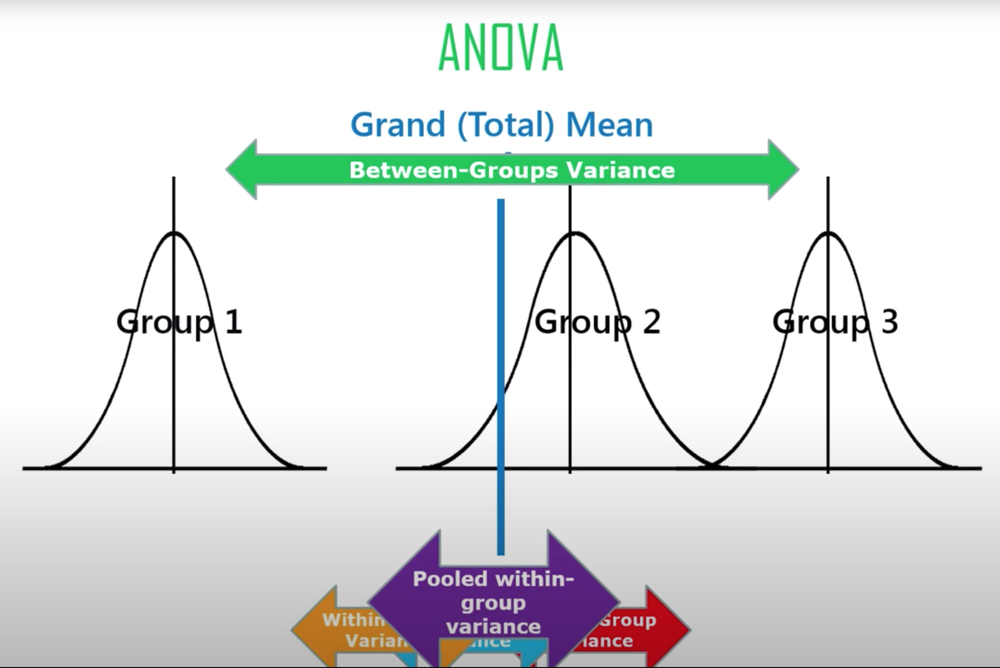
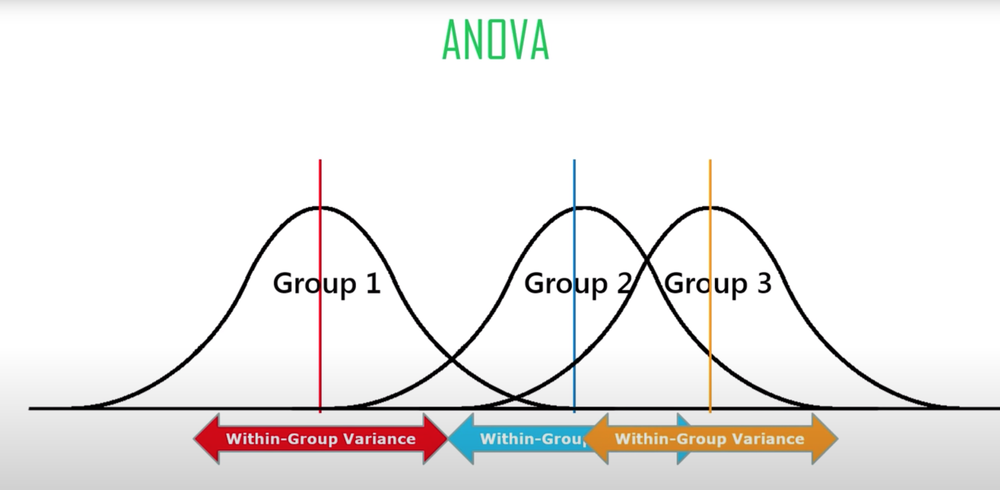
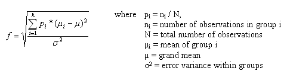

# Notebook

## p-value

Concepts:
* The smaller the **p-value**, the more statistically significant the result

  
  

Observations:
* Price A's conversion rate: 200/23739 = 0.8425%
* Price B's conversion rate: 182/22588 = 0.8057%
* The difference is 0.8425% - 0.8057% = 0.0368%

Assumptions:
* The random variation is produced by a probability model that embodies the **null hypothesis** that the difference occurs by chance.

Resampling:
1. Create an box with all sample results: 382 ones + 45945 zeros
2. Shuffle and draw out a resample of size: 23739 = same n as price A, and record how many ones
3. Record how many ones in the rest: 22588 = same n as price B
4. Record the difference in the percentage of ones
5. Repeat steps 2-4
6. How often is the difference >= 0.0368%, and this is **p-value**

## ANOVA

Concepts:
* ANOVA is A/B/C/D... test measured by **F-statistic**, whereas **T-test** is A/B test measured by **T-statistic**
* **F-statistic**: between-groups variance / within-groups variance
	* Grand mean = mean of group means
	* Between-groups variance = variance of group means
	* Within-groups variance = sum of group variances / num of groups
	* The **bigger** the **F-statistic**, the more statistically significant the result

Assumptions:
* The **normal distribution** of data

  
  

  
  

Resampling:
1. Combine all the data in a single box
2. Shuffle and draw out 4 resamples of 5 values each
3. Record the **mean** of each of the 4 groups
4. Record the **variance** among the 4 **group means**
5. Repeat steps 2-4 many times
6. How often does the resampled variance >= the observed variance, and this is **p-value**

## Chi-Square Test

Concepts:
* Chi-square test is measured by **Chi-square statistic**

Assumptions:
*  The data in the cells are **frequencies**

  
  
  

Observations:
* The expected click rate: (14 + 8 + 12) / (14 + 986 + 8 + 992 + 12 + 988) = 34 / 3000 = 0.01133
* The expected number of clicks: 0.01133 * 1000 = 11.33

Formulas:
* Pearson residue
* Chi-square statistic

  
  

Resampling:
1. Create an box with 34 ones (clicks) and 2966 zeros (no clicks)
2. Shuffle and draw out 3 resamples of 1000 values each, and record how many ones
3. Find the squared differences between the shuffled ones and the expected ones (pearson-residue), and sum them (chi-square statistic)
4. Repeat steps 2-3 many times
5. How often does the resampled sum of squared deviations >= the observed deviation, and that is **p-value**

## Power test

Concepts:
* **Power**: the probability of detecting a given effect size given a sample size
* **Significance level**: The statistical significance level at which the test is conducted
* **Effect size**: The minimun size of the effect that you hope to detect in a statistical test, e.g., "a 20% improvement in click rates"
	* The bigger the actual difference between A and B, the greater the probability that our test will reveal it
	* The smaller the actual difference between A and B, the more data will be needed to detect it
* There are four moving parts to calculate power or required sample size, specify any three of them, and the fourth can be calculated:
	* Sample size
	* Effect size you want to detect
	* Significance level (alpha) at which the test is conducted
	* Power

Formulas:
* pwr.anova.test(k = , n = , f = , sig.level = , power = )
	* k = the number of groups
	* n = the common sample size in each group
	* f = effect size

* pwr.chisq.test(w =, N = , df = , sig.level =, power = )
	* w = effect size
	* N = the total sample size
	* df = the degrees of freedom

  
  

## Reference:
* https://www.youtube.com/watch?v=RAwlr6FGhjo
* https://www.statmethods.net/stats/power.html
