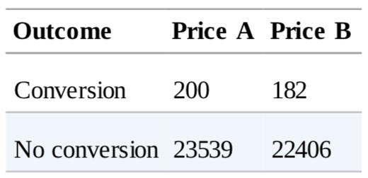
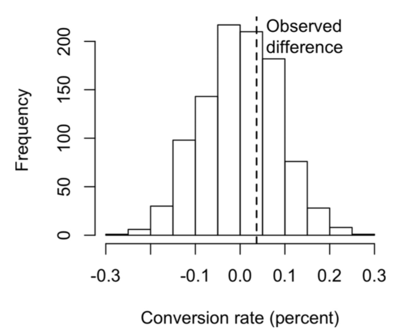
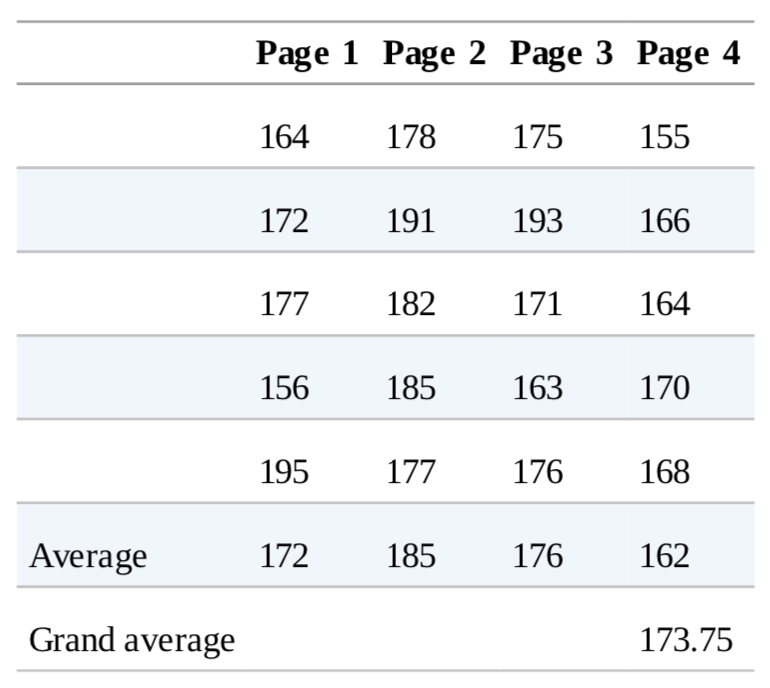
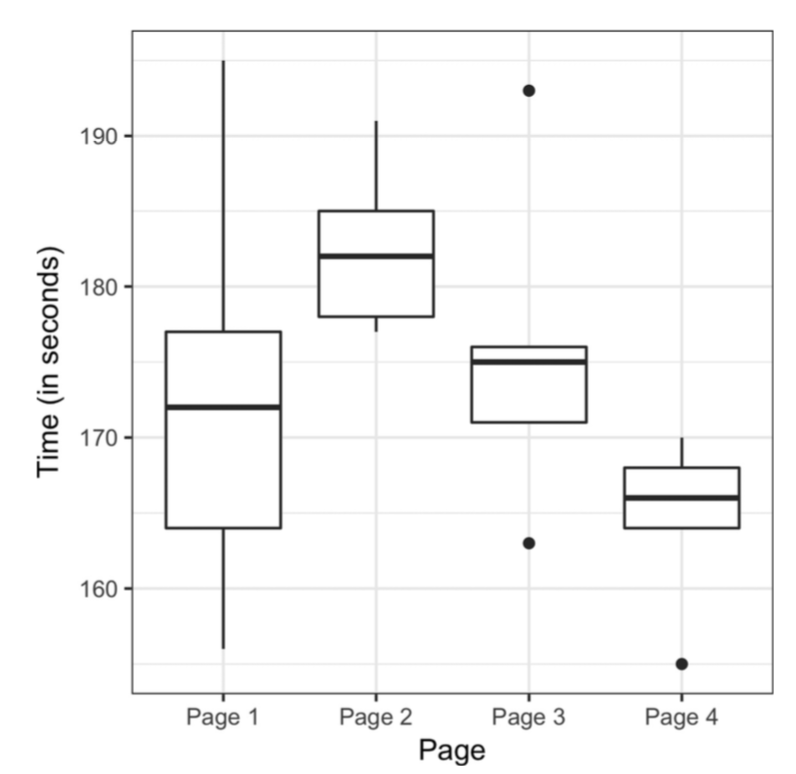
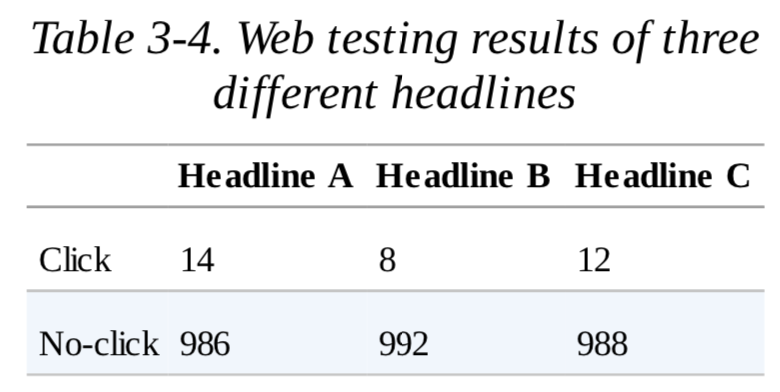
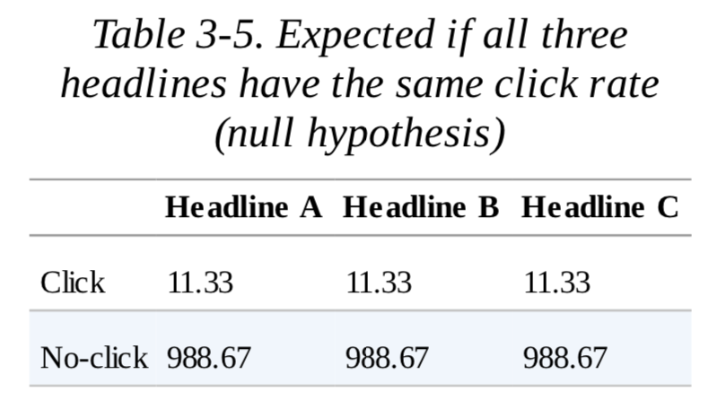
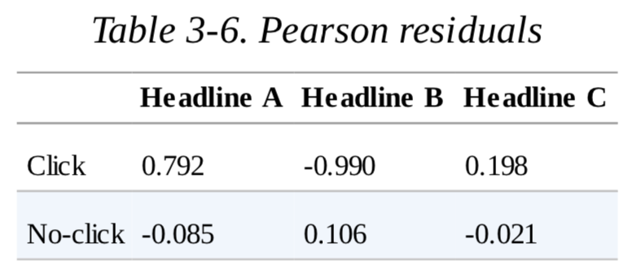
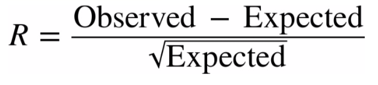
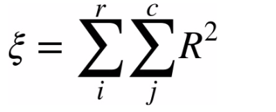

# Notebook

## p-value

  
  

Observations:
* Price A's conversion rate: 200/23739 = 0.8425%
* Price B's conversion rate: 182/22588 = 0.8057%
* The difference is 0.8425% - 0.8057% = 0.0368%

Assumptions:
* The random variation is produced by a probability model that embodies the **null hypothesis** that the difference occurs by chance.

Resampling:
1. Create an box with all sample results: 382 ones + 45945 zeros
2. Shuffle and draw out a resample of size: 23739 = same n as price A, and record how many ones
3. Record how many ones in the rest: 22588 = same n as price B
4. Record the difference in the percentage of ones
5. Repeat steps 2-4
6. How often is the difference >= 0.0368%, and this is **p-value**

## ANOVA

Concepts:
* A hypothesis test between two groups among multiple groups
* **F-statistic**: differences among **group means** which exceed what might be expected in a chance model

  
  

Resampling:
1. Combine all the data in a single box
2. Shuffle and draw out 4 resamples of 5 values each
3. Record the **mean** of each of the 4 groups
4. Record the **variance** among the 4 **group means**
5. Repeat steps 2-4 many times
6. How often does the resampled variance >= the observed variance, and this is **p-value**

## Chi-Square Test

  
  
  

Observations:
* The expected click rate: (14 + 8 + 12) / (14 + 986 + 8 + 992 + 12 + 988) = 34 / 3000 = 0.01133
* The expected number of clickes: 0.01133 * 1000 = 11.33

Formulas:

  
  

Resampling:
1. Create an box with 34 ones (clicks) and 2966 zeros (no clicks)
2. Shuffle and draw out 3 resamples of 1000 values each, and record how many ones
3. Find the squared differences between the shuffled ones and the expected ones (pearson-residue), and sum them (chi-square statistic)
4. Repeat steps 2-3 many times
5. How often does the resampled sum of squared deviations >= the observed deviation, and that is **p-value**

